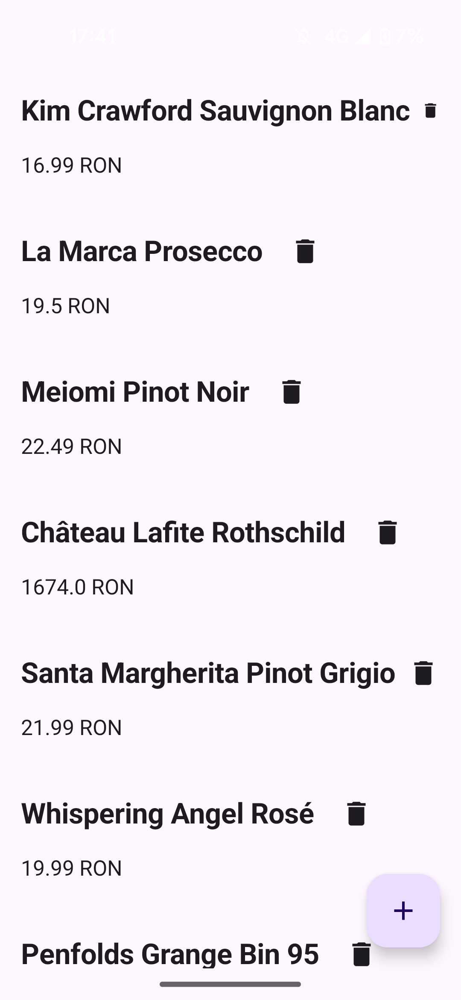

# 🍷 Wine Menu Mobile App

## **Description**

The **Wine Menu Mobile App** is a simple and elegant tool designed for restaurants to easily display and manage their wine selection. When customers or staff open the app, they can instantly see a list of all available wines with their names and prices. By selecting a wine, they can view all its details — such as where and when it was made, and its alcohol percentage.  
The app also allows restaurant staff to add, edit, or delete wines. Built with real-time collaboration in mind, any change made by one user is instantly reflected on all other devices currently using the app. The app remains fully functional even when the internet is unavailable or the external server is unreachable, storing new wines locally until a connection is re-established.

## **Technical Architecture**

The system is built using a modern, high-performance stack designed for reliability and real-time synchronization.

| Component             | Technology                | Details |
|------------------:|---------------------|-------------|
| **Mobile Client** | Kotlin | A robust native application ensuring smooth performance and offline capabilities using local persistence (Room/SQLite). |
| **Backend Server** | Go | A high-concurrency server handling API requests and managing WebSocket connections for live updates. |
| **Database** | PostgreSQL / Room | A relational database ensuring ACID compliance and reliable storage for the wine inventory. |
| **Communication** | REST & WebSockets | REST is used for CRUD actions, while WebSockets push live updates to all connected clients immediately. |

## **Domain Details**

The app has a single main entity: **Wine**. Each wine represents one product in the restaurant’s wine list and includes the following fields:

| Field | Type | Description |
|------------------:|---------------------|-------------|
| **Name** | Text | The name of the wine as it appears on the restaurant’s menu. |
| **Price** | Number (e.g. 24.99) | The selling price of the wine in the restaurant’s currency. |
| **Production Date** | Date | The year or exact date the wine was made. Helps identify its age and quality. |
| **Origin Location** | Text | The geographical area (e.g. Bordeaux, France) where the wine was produced. |
| **Alcohol Degree** | Number (e.g. 13%) | The percentage of alcohol contained in the wine. |

## **CRUD Operations**

The app provides full CRUD functionality (Create, Read, Update, Delete) for managing wines:

| Operation | Description | UI Location |
|----------:|-------------|-------------|
| **Create** | Add a new wine by pressing the **Floating Action Button (+)**. This navigates the user to a dedicated input form where they enter all wine details and **save the new wine using the checkmark button** on that page. | Floating Action Button in the bottom-right corner of the main screen. |
| **Read** | View all wines as a list. Tapping a wine navigates the user to its details/edit page. | Main screen (list view) and details page. |
| **Update** | Edit a wine by **tapping its entry on the main list**, which sends the user to a dedicated form pre-filled with the wine's current details. The user modifies the fields and **saves the changes using the checkmark button** on that page. | Tapping a wine in the list (to enter the form) and the checkmark button (to save). |
| **Delete** | Delete a wine from the main list view. | Trash can icon next to the wine on the main list view. |

## **Persistence and Offline Behavior**

The app uses two storage layers:

- **Online Server Database** – main data source when internet is available.  
- **Local Database (Partial Replica / On-Demand Cache)** – a local copy of wines the user has viewed or created.

This ensures the app works reliably without an internet connection or during server outages.

### ✅ **Online Mode & Real-Time Updates**

When the device has an internet connection and the server is running:

- **REST API:** All CRUD operations (Create, Read, Update, Delete) are sent to the Go server via HTTP requests.

- **WebSockets:** The app maintains an open WebSocket connection. When any user modifies a wine, the server broadcasts a message to all other connected clients.

- **Live UI:** The app listens for these WebSocket messages and updates the list view instantly without the user needing to refresh.

- **Persistence:** The local database stores a copy of any data received from the server (REST or WebSocket) to ensure the cache is always fresh.

### ⚙️ **Offline & Server Unavailable Mode**

When the device has no internet connection, or when the device is online but the server is returning errors (e.g., 500 Internal Server Error, Timeout), the app automatically switches to local handling:

| Operation | Offline Behavior |
|----------:|------------------|
| **Create (Add)** | Works normally. New wines are stored locally and shown to the user immediately. They are marked as “pending” until synchronization. |
| **Read (View)** | The app displays wines from the local database. Only the wines previously loaded or changed while offline are visible. |
| **Update (Edit)** | Works locally. The user can modify wines stored in the local DB. Changes are marked as “pending updates” and synced when online. |
| **Delete (Remove)** | Works locally. Wines marked for deletion are hidden from the interface and flagged as “pending deletion” until synced. |

## **🔄 Synchronization on Reconnection**

When the internet connection is restored or the server becomes reachable again:

1. All pending **new**, **updated**, and **deleted** wines are automatically sent to the server.  
2. If all operations complete successfully, local copies are marked as synchronized.  
3. If some wines conflict with existing server data, the user is notified, and only non-conflicting items are applied.  
4. The local database is refreshed with the latest server data.
5. Broadcast: Once the server successfully processes the offline changes, it broadcasts these updates via WebSockets to all other currently connected users, ensuring everyone stays in sync.

This mechanism preserves data integrity while keeping the app usable offline.

## **Offline Scenarios**

Below are example scenarios for each CRUD operation while offline:

### 🆕 **Create Example**
The user adds a new wine named *“Château Soleil 2020”* while the restaurant Wi-Fi is down.  
The app stores it locally and displays it in the list with a small “⏳ Pending Sync” label.  
When internet returns, the wine is automatically uploaded to the server and the label disappears.

### 📖 **Read Example**
The user opens the app while offline.  
It can still browse wines they viewed earlier that are cached locally.
Wines changed after the last connection will appear with a “pending" label until it reconnects.

### ✏️ **Update Example**
The user edits the price of “Cabernet Noir 2019” while the device has 4G, but the backend server is undergoing maintenance. 
The app detects the server is unreachable, updates the local record, and marks it as “Pending Update.” 
Once the server is back online, the change syncs automatically.

### 🗑️ **Delete Example**
The user deletes *“Old Barrel 2015”* while offline.  
The wine disappears from the local list and is flagged as “Pending Deletion.”  
After reconnection, the app deletes it on the server as well.

## **App mockup**

## **Summary**

| Feature | Online | Offline / Server Unreachable |
|---------------:|:------:|:----------------|
| View Wines | ✅ | ✅ (cached items only) |
| Add Wine | ✅ | ✅ (stored locally until sync) |
| Update Wine | ✅ | ✅ (stored locally until sync) |
| Delete Wine | ✅ | ✅ (stored locally until sync) |
| Data Sync | Automatic | Automatic when reconnected |

---

This setup ensures that the **Wine Menu Mobile App** remains reliable and responsive, even in areas with unstable or no internet connection.
